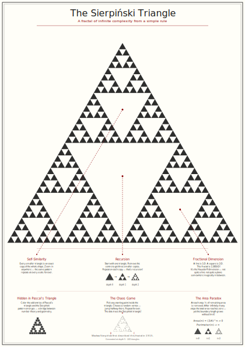
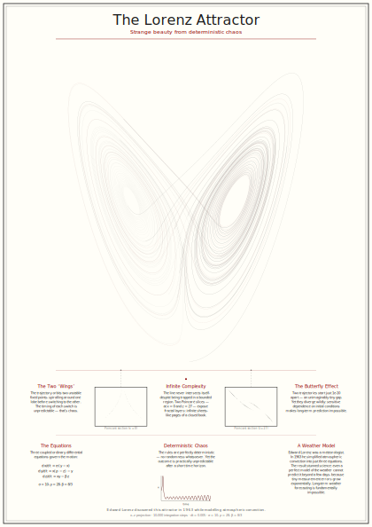
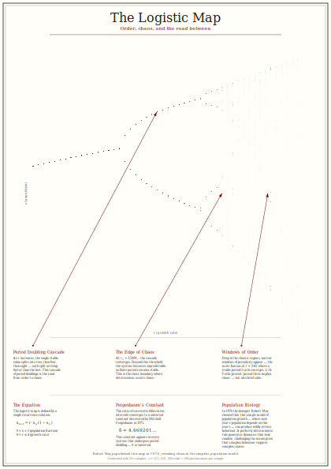

# Wall Tart — Museum-Quality Mathematical Poster Generators

A collection of Python tools that generate museum-quality, annotated vector posters of iconic mathematical objects — suitable for large-format printing (A2 and above).

---

## 🔺 Sierpiński Triangle Poster



### Quick Start

```bash
git clone https://github.com/rotblauer/wall_tart.git
cd wall_tart

# Generate an SVG poster (no dependencies needed)
python sierpinski_poster.py
```

This creates **`sierpinski_poster.svg`** — an A2-sized (420 × 594 mm) annotated poster at depth 7 (2,187 triangles).

### Features

- **Museum-style annotations** with leader-line callouts:
  | Annotation | Description |
  |---|---|
  | **Self-Similarity** | Arrow pointing to a sub-triangle explaining how every part mirrors the whole. |
  | **Recursion** | Visual step-by-step diagram (depth 0 → 1 → 2) showing the removal rule. |
  | **Fractional Dimension** | Kid-friendly note on the Hausdorff dimension (~1.585 — not 1-D, not 2-D!). |
- **Educational panels** — a second row of mathematical connections:
  | Panel | Description |
  |---|---|
  | **Hidden in Pascal's Triangle** | Pascal's triangle mod 2 visualisation — odd entries form the Sierpiński pattern. |
  | **The Chaos Game** | Scatter-dot demo of the random vertex-jumping algorithm that produces the fractal. |
  | **The Area Paradox** | Formulas and mini diagrams showing area → 0 yet perimeter → ∞. |

### Options

| Flag | Default | Description |
|---|---|---|
| `--depth N` | `7` | Fractal recursion depth. Higher values produce more detail. |
| `--output FILE` | `sierpinski_poster.<fmt>` | Output file path. |
| `--format FMT` | `svg` | Output format: `svg` or `pdf`. |
| `--width MM` | `420` | Poster width in millimetres (A2 default). |
| `--height MM` | `594` | Poster height in millimetres (A2 default). |
| `--designed-by TEXT` | *(none)* | Designer credit, e.g. `'Alice and Bob'`. |
| `--designed-for TEXT` | *(none)* | Client / purpose credit, e.g. `'the Science Museum'`. |

### Depth vs. Triangle Count

| Depth | Triangles | Notes |
|---|---|---|
| 5 | 243 | Quick preview |
| 7 | 2,187 | Default — good balance of detail and speed |
| 9 | 19,683 | High detail |
| 11 | 177,147 | Very fine detail; larger file |

---

## 🦋 Lorenz Attractor Poster



### Quick Start

```bash
# Generate the Lorenz attractor poster (no dependencies needed)
python lorenz_poster.py
```

This creates **`lorenz_poster.svg`** — an A2-sized (420 × 594 mm) annotated poster with 200,000 integration steps. The 3D trajectory of the strange attractor is projected to 2D, showing the iconic "butterfly" shape with a second diverging trajectory in red that demonstrates sensitive dependence on initial conditions.

### Features

- **Millions of points** rendered via a 4th-order Runge-Kutta integrator for a smooth, visually striking trajectory.
- **Museum-style annotations** with leader-line callouts:
  | Annotation | Description |
  |---|---|
  | **The Butterfly Effect** | Highlights two trajectories that start 10⁻¹⁰ apart but diverge wildly — sensitive dependence on initial conditions. |
  | **The Two 'Wings'** | Points out the two unstable fixed points that the trajectory orbits around. |
  | **Infinite Complexity** | Notes how the line never intersects itself despite being trapped in a bounded space. |
- **Educational panels** — a second row of scientific context:
  | Panel | Description |
  |---|---|
  | **The Equations** | The three Lorenz ODEs with parameter values (σ = 10, ρ = 28, β = 8/3). |
  | **Deterministic Chaos** | Mini divergence plot showing two initially close trajectories separating over time. |
  | **A Weather Model** | The meteorological origins of the Lorenz system and why long-term weather prediction is impossible. |

### Options

| Flag | Default | Description |
|---|---|---|
| `--steps N` | `200000` | Number of integration steps. Higher = more detail. |
| `--output FILE` | `lorenz_poster.<fmt>` | Output file path. |
| `--format FMT` | `svg` | Output format: `svg` or `pdf`. |
| `--width MM` | `420` | Poster width in millimetres (A2 default). |
| `--height MM` | `594` | Poster height in millimetres (A2 default). |
| `--designed-by TEXT` | *(none)* | Designer credit, e.g. `'Alice and Bob'`. |
| `--designed-for TEXT` | *(none)* | Client / purpose credit, e.g. `'the Science Museum'`. |

### Steps vs. Detail

| Steps | Approx. Time (s) | Notes |
|---|---|---|
| 5,000 | < 1 | Quick preview |
| 50,000 | ~1 | Good detail |
| 200,000 | ~3 | Default — smooth, publication-quality |
| 1,000,000 | ~15 | Ultra-fine detail; larger file |

---

## 📈 Logistic Map Poster



### Quick Start

```bash
# Generate the Logistic Map bifurcation poster (no dependencies needed)
python logistic_map_poster.py
```

This creates **`logistic_map_poster.svg`** — an A2-sized (420 × 594 mm) annotated poster with 2,000 r-parameter samples. The bifurcation diagram reveals how a simple population model transitions from stable equilibria through period doubling to full chaos, with surprising windows of order along the way.

### Features

- **Millions of points** plotted efficiently to capture fine bifurcation detail across 2,000+ r-parameter values.
- **Museum-style annotations** with leader-line callouts:
  | Annotation | Description |
  |---|---|
  | **Period Doubling Cascade** | Points to the distinct splits where the population alternates between 2, 4, 8… values — the road from order to chaos. |
  | **The Edge of Chaos** | Highlights the Feigenbaum point (r ≈ 3.5699) where the system becomes unpredictable. |
  | **Windows of Order** | A callout to the famous period-3 window at r ≈ 3.83, where brief moments of predictability emerge amid chaos. |
- **Educational panels** — a second row of mathematical context:
  | Panel | Description |
  |---|---|
  | **The Equation** | The logistic recurrence x_{n+1} = r·x_n(1 − x_n) with parameter ranges. |
  | **Feigenbaum's Constant** | The universal constant δ ≈ 4.669201… that governs all period-doubling cascades. |
  | **Population Biology** | Robert May's 1976 discovery that this simple model produces chaotic dynamics. |

### Options

| Flag | Default | Description |
|---|---|---|
| `--r-count N` | `2000` | Number of r-parameter samples. Higher = finer detail. |
| `--output FILE` | `logistic_map_poster.<fmt>` | Output file path. |
| `--format FMT` | `svg` | Output format: `svg` or `pdf`. |
| `--width MM` | `420` | Poster width in millimetres (A2 default). |
| `--height MM` | `594` | Poster height in millimetres (A2 default). |
| `--designed-by TEXT` | *(none)* | Designer credit, e.g. `'Alice and Bob'`. |
| `--designed-for TEXT` | *(none)* | Client / purpose credit, e.g. `'the Science Museum'`. |

### r-Count vs. Detail

| r-Count | Approx. Time (s) | Notes |
|---|---|---|
| 200 | < 1 | Quick preview |
| 2,000 | ~1 | Default — good balance of detail and speed |
| 5,000 | ~3 | High detail |
| 10,000 | ~6 | Ultra-fine detail; larger file |

---

## Common Information

### Requirements

- **Python 3.8+** (uses only the standard library for SVG output).
- *(Optional)* [`cairosvg`](https://cairosvg.org/) for PDF export.

### Advanced Usage

```bash
# Sierpiński: higher depth and custom output
python sierpinski_poster.py --depth 9 --output my_poster.svg

# Lorenz: more integration steps
python lorenz_poster.py --steps 500000 --output lorenz_hires.svg

# Logistic Map: more r-parameter samples
python logistic_map_poster.py --r-count 5000 --output logistic_hires.svg

# Generate PDFs directly (requires cairosvg)
pip install cairosvg
python sierpinski_poster.py --format pdf --output sierpinski.pdf
python lorenz_poster.py --format pdf --output lorenz.pdf
python logistic_map_poster.py --format pdf --output logistic_map.pdf

# Custom poster dimensions (width × height in mm)
python sierpinski_poster.py --width 594 --height 841   # A1 size
python lorenz_poster.py --width 594 --height 841
python logistic_map_poster.py --width 594 --height 841

# Add custom credit lines
python sierpinski_poster.py --designed-by "Alice" --designed-for "the Science Museum"
python lorenz_poster.py --designed-by "Alice" --designed-for "the Science Museum"
python logistic_map_poster.py --designed-by "Alice" --designed-for "the Science Museum"
```

### Running Tests

```bash
pip install pytest
pytest test_sierpinski.py test_lorenz.py test_logistic_map.py -v
```

### Docker

Build and run the poster generators in a container (includes `cairosvg` for PDF):

```bash
# Build the image
docker build -t wall-tart .

# Generate Sierpiński poster
docker run -v "$(pwd)/output:/app/output" \
  wall-tart python sierpinski_poster.py --depth 7 --output output/sierpinski_poster.svg

# Generate Lorenz poster
docker run -v "$(pwd)/output:/app/output" \
  wall-tart python lorenz_poster.py --steps 200000 --output output/lorenz_poster.svg

# Generate Logistic Map poster
docker run -v "$(pwd)/output:/app/output" \
  wall-tart python logistic_map_poster.py --r-count 2000 --output output/logistic_map_poster.svg
```

### CI / GitHub Actions

The repository includes two workflows:

**`ci.yml`** — runs on every push and pull request to `main`:
1. Runs the full test suite (`test_sierpinski.py`, `test_lorenz.py`, and `test_logistic_map.py`) with `pytest`.
2. Builds the Docker image.
3. Generates sample posters and uploads them as build artifacts.

**`update-readme-images.yml`** — runs on every push to `main` that touches the poster generators or the workflow itself (and can be triggered manually via `workflow_dispatch`):
1. Regenerates `docs/generated/sierpinski_poster.svg`, `docs/generated/lorenz_poster.svg`, and `docs/generated/logistic_map_poster.svg`.
2. Commits and pushes the updated images back to `main` so the README always shows the current output.

### How It Works

**Sierpiński Triangle**:
1. An equilateral triangle is defined by its centre and side length.
2. An iterative stack replaces naive recursion — at each step the triangle is split into three sub-triangles (the middle is removed).
3. The filled triangles are written as `<polygon>` elements inside an SVG document.
4. Leader lines connect explanatory text blocks to specific regions of the fractal.

**Lorenz Attractor**:
1. The Lorenz system of three coupled ODEs is integrated using a 4th-order Runge-Kutta method.
2. The 3D trajectory is projected to 2D via a rotation matrix for an optimal viewing angle.
3. The trajectory is rendered as `<polyline>` elements, with a second diverging trajectory to illustrate the butterfly effect.
4. Leader lines connect annotated text blocks to specific dynamics of the system.

**Logistic Map**:
1. The logistic recurrence x_{n+1} = r·x_n(1 − x_n) is iterated for thousands of r values across [2.5, 4.0].
2. For each r, transient iterations are discarded before collecting steady-state values — producing the bifurcation diagram.
3. Each (r, x) point is rendered as a tiny `<circle>` element in the SVG, capturing period doubling, chaos, and windows of order.
4. Leader lines connect annotated text blocks to specific mathematical milestones on the diagram.

## License

[MIT](LICENSE)
