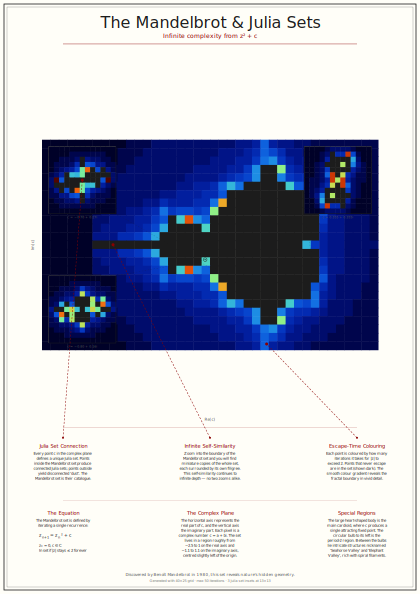
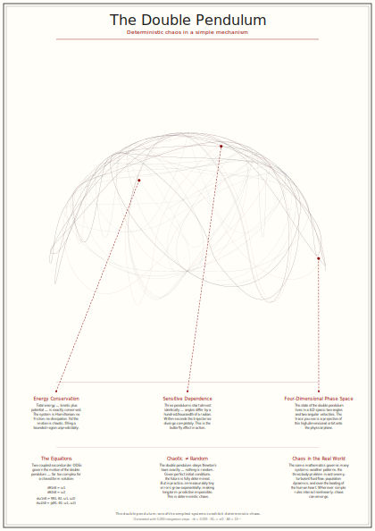
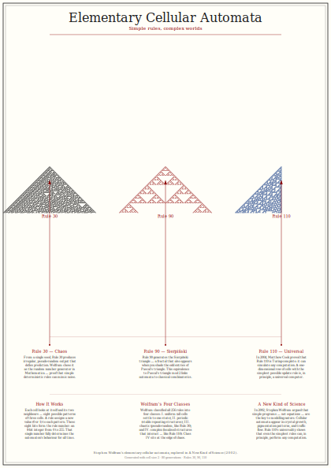
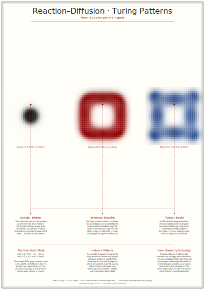
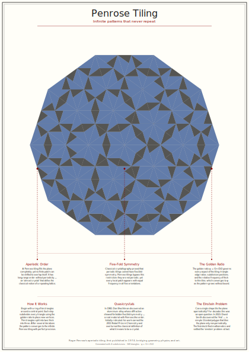
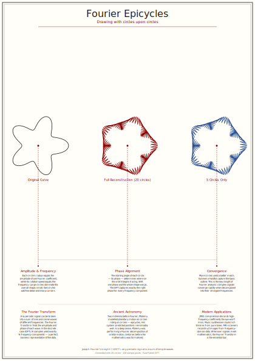
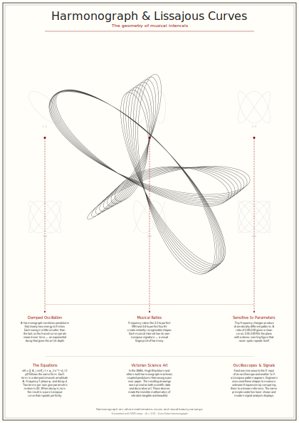
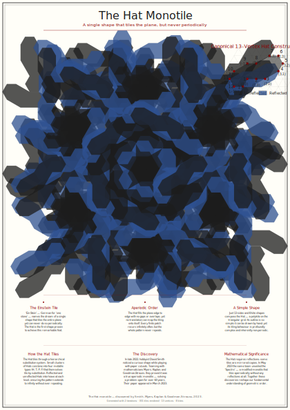
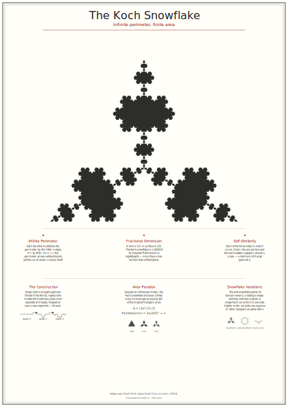

# Wall Tart — Museum-Quality Mathematical Poster Generators

A collection of Python tools that generate museum-quality, annotated vector posters of iconic mathematical objects — suitable for large-format printing (A2 and above).

---

## 🔺 Sierpiński Triangle Poster


### Quick Start

```bash
git clone https://github.com/rotblauer/wall_tart.git
cd wall_tart

# Generate an SVG poster (no dependencies needed)
python sierpinski_poster.py
```

This creates **`sierpinski_poster.svg`** — an A2-sized (420 × 594 mm) annotated poster at depth 7 (2,187 triangles).

### Features

- **Museum-style annotations** with leader-line callouts:
  | Annotation | Description |
  |---|---|
  | **Self-Similarity** | Arrow pointing to a sub-triangle explaining how every part mirrors the whole. |
  | **Recursion** | Visual step-by-step diagram (depth 0 → 1 → 2) showing the removal rule. |
  | **Fractional Dimension** | Kid-friendly note on the Hausdorff dimension (~1.585 — not 1-D, not 2-D!). |
- **Educational panels** — a second row of mathematical connections:
  | Panel | Description |
  |---|---|
  | **Hidden in Pascal's Triangle** | Pascal's triangle mod 2 visualisation — odd entries form the Sierpiński pattern. |
  | **The Chaos Game** | Scatter-dot demo of the random vertex-jumping algorithm that produces the fractal. |
  | **The Area Paradox** | Formulas and mini diagrams showing area → 0 yet perimeter → ∞. |

### Options

| Flag | Default | Description |
|---|---|---|
| `--depth N` | `7` | Fractal recursion depth. Higher values produce more detail. |
| `--output FILE` | `sierpinski_poster.<fmt>` | Output file path. |
| `--format FMT` | `svg` | Output format: `svg` or `pdf`. |
| `--width MM` | `420` | Poster width in millimetres (A2 default). |
| `--height MM` | `594` | Poster height in millimetres (A2 default). |
| `--designed-by TEXT` | *(none)* | Designer credit, e.g. `'Alice and Bob'`. |
| `--designed-for TEXT` | *(none)* | Client / purpose credit, e.g. `'the Science Museum'`. |

### Depth vs. Triangle Count

| Depth | Triangles | Notes |
|---|---|---|
| 5 | 243 | Quick preview |
| 7 | 2,187 | Default — good balance of detail and speed |
| 9 | 19,683 | High detail |
| 11 | 177,147 | Very fine detail; larger file |

---

## 🦋 Lorenz Attractor Poster


### Quick Start

```bash
# Generate the Lorenz attractor poster (no dependencies needed)
python lorenz_poster.py
```

This creates **`lorenz_poster.svg`** — an A2-sized (420 × 594 mm) annotated poster with 200,000 integration steps. The 3D trajectory of the strange attractor is projected to 2D, showing the iconic "butterfly" shape with a second diverging trajectory in red that demonstrates sensitive dependence on initial conditions.

### Features

- **Millions of points** rendered via a 4th-order Runge-Kutta integrator for a smooth, visually striking trajectory.
- **Museum-style annotations** with leader-line callouts:
  | Annotation | Description |
  |---|---|
  | **The Butterfly Effect** | Highlights two trajectories that start 10⁻¹⁰ apart but diverge wildly — sensitive dependence on initial conditions. |
  | **The Two 'Wings'** | Points out the two unstable fixed points that the trajectory orbits around. |
  | **Infinite Complexity** | Notes how the line never intersects itself despite being trapped in a bounded space. |
- **Educational panels** — a second row of scientific context:
  | Panel | Description |
  |---|---|
  | **The Equations** | The three Lorenz ODEs with parameter values (σ = 10, ρ = 28, β = 8/3). |
  | **Deterministic Chaos** | Mini divergence plot showing two initially close trajectories separating over time. |
  | **A Weather Model** | The meteorological origins of the Lorenz system and why long-term weather prediction is impossible. |

### Options

| Flag | Default | Description |
|---|---|---|
| `--steps N` | `200000` | Number of integration steps. Higher = more detail. |
| `--output FILE` | `lorenz_poster.<fmt>` | Output file path. |
| `--format FMT` | `svg` | Output format: `svg` or `pdf`. |
| `--width MM` | `420` | Poster width in millimetres (A2 default). |
| `--height MM` | `594` | Poster height in millimetres (A2 default). |
| `--designed-by TEXT` | *(none)* | Designer credit, e.g. `'Alice and Bob'`. |
| `--designed-for TEXT` | *(none)* | Client / purpose credit, e.g. `'the Science Museum'`. |

### Steps vs. Detail

| Steps | Approx. Time (s) | Notes |
|---|---|---|
| 5,000 | < 1 | Quick preview |
| 50,000 | ~1 | Good detail |
| 200,000 | ~3 | Default — smooth, publication-quality |
| 1,000,000 | ~15 | Ultra-fine detail; larger file |

---

## 📈 Logistic Map Poster


### Quick Start

```bash
# Generate the Logistic Map bifurcation poster (no dependencies needed)
python logistic_map_poster.py
```

This creates **`logistic_map_poster.svg`** — an A2-sized (420 × 594 mm) annotated poster with 2,000 r-parameter samples. The bifurcation diagram reveals how a simple population model transitions from stable equilibria through period doubling to full chaos, with surprising windows of order along the way.

### Features

- **Millions of points** plotted efficiently to capture fine bifurcation detail across 2,000+ r-parameter values.
- **Museum-style annotations** with leader-line callouts:
  | Annotation | Description |
  |---|---|
  | **Period Doubling Cascade** | Points to the distinct splits where the population alternates between 2, 4, 8… values — the road from order to chaos. |
  | **The Edge of Chaos** | Highlights the Feigenbaum point (r ≈ 3.5699) where the system becomes unpredictable. |
  | **Windows of Order** | A callout to the famous period-3 window at r ≈ 3.83, where brief moments of predictability emerge amid chaos. |
- **Educational panels** — a second row of mathematical context:
  | Panel | Description |
  |---|---|
  | **The Equation** | The logistic recurrence x_{n+1} = r·x_n(1 − x_n) with parameter ranges. |
  | **Feigenbaum's Constant** | The universal constant δ ≈ 4.669201… that governs all period-doubling cascades. |
  | **Population Biology** | Robert May's 1976 discovery that this simple model produces chaotic dynamics. |

### Options

| Flag | Default | Description |
|---|---|---|
| `--r-count N` | `2000` | Number of r-parameter samples. Higher = finer detail. |
| `--output FILE` | `logistic_map_poster.<fmt>` | Output file path. |
| `--format FMT` | `svg` | Output format: `svg` or `pdf`. |
| `--width MM` | `420` | Poster width in millimetres (A2 default). |
| `--height MM` | `594` | Poster height in millimetres (A2 default). |
| `--designed-by TEXT` | *(none)* | Designer credit, e.g. `'Alice and Bob'`. |
| `--designed-for TEXT` | *(none)* | Client / purpose credit, e.g. `'the Science Museum'`. |

### r-Count vs. Detail

| r-Count | Approx. Time (s) | Notes |
|---|---|---|
| 200 | < 1 | Quick preview |
| 2,000 | ~1 | Default — good balance of detail and speed |
| 5,000 | ~3 | High detail |
| 10,000 | ~6 | Ultra-fine detail; larger file |

---

## 🌀 Mandelbrot Set Poster



### Quick Start

```bash
# Generate the Mandelbrot Set poster (no dependencies needed)
python mandelbrot_poster.py
```

This creates **`mandelbrot_poster.svg`** — an A2-sized (420 × 594 mm) annotated poster of the Mandelbrot Set with Julia set thumbnails. The escape-time algorithm colours each point by how quickly it diverges, revealing the iconic fractal boundary.

### Features

- **Escape-time colouring** renders the fractal boundary in a smooth gradient, with the set interior in dark ink.
- **Julia set thumbnails** — three representative Julia sets are displayed below the main image, each linked to its generating *c* parameter in the Mandelbrot plane.
- **Museum-style annotations** with leader-line callouts:
  | Annotation | Description |
  |---|---|
  | **Self-Similarity** | Zooming into the boundary reveals smaller copies of the whole set — infinite nesting at every scale. |
  | **Escape-Time Colouring** | Explains the algorithm: iterate z² + c and colour by how many steps until |z| > 2. |
  | **Julia Set Connection** | Each point *c* in the Mandelbrot set determines a unique Julia set — the poster visualises this correspondence. |
- **Educational panels** — a second row of mathematical context:
  | Panel | Description |
  |---|---|
  | **The Equation** | The defining iteration z_{n+1} = z_n² + c and what convergence/divergence means. |
  | **The Complex Plane** | What the axes represent: the real and imaginary parts of *c*. |
  | **Special Regions** | Famous features: the main cardioid, period-2 bulb, seahorse valley, and elephant valley. |

### Options

| Flag | Default | Description |
|---|---|---|
| `--resolution N` | `80` | Grid width in pixels. Higher = finer detail. |
| `--max-iter N` | `100` | Maximum escape iterations. Higher = more boundary detail. |
| `--output FILE` | `mandelbrot_poster.<fmt>` | Output file path. |
| `--format FMT` | `svg` | Output format: `svg`, `pdf`, or `png`. |
| `--width MM` | `420` | Poster width in millimetres (A2 default). |
| `--height MM` | `594` | Poster height in millimetres (A2 default). |
| `--designed-by TEXT` | *(none)* | Designer credit. |
| `--designed-for TEXT` | *(none)* | Client / purpose credit. |

---

## ⚛️ Double Pendulum Poster



### Quick Start

```bash
# Generate the Double Pendulum poster (no dependencies needed)
python double_pendulum_poster.py
```

This creates **`double_pendulum_poster.svg`** — an A2-sized (420 × 594 mm) annotated poster showing the chaotic trajectory of a double pendulum. Three trajectories with nearly identical starting conditions diverge wildly, demonstrating sensitive dependence on initial conditions.

### Features

- **Three diverging trajectories** — starting angles differ by only 10⁻⁵ radians, yet the paths diverge dramatically.
- **4th-order Runge-Kutta integration** for accurate simulation of the coupled ODEs.
- **Museum-style annotations** with leader-line callouts:
  | Annotation | Description |
  |---|---|
  | **Sensitive Dependence** | How immeasurably small differences in initial conditions lead to completely different outcomes. |
  | **Phase Space** | The double pendulum lives in a 4-dimensional phase space (two angles, two angular velocities). |
  | **Energy Conservation** | Total energy is conserved — the motion is chaotic but not random. |
- **Educational panels** — a second row of scientific context:
  | Panel | Description |
  |---|---|
  | **The Equations** | The coupled ODEs of motion for the double pendulum system. |
  | **Chaos vs. Random** | Deterministic chaos looks random but is governed by exact equations. |
  | **Physical Systems** | Real-world chaotic systems: weather, planetary orbits, population dynamics. |

### Options

| Flag | Default | Description |
|---|---|---|
| `--steps N` | `10000` | Integration steps. Higher = longer trajectory. |
| `--output FILE` | `double_pendulum_poster.<fmt>` | Output file path. |
| `--format FMT` | `svg` | Output format: `svg`, `pdf`, or `png`. |
| `--width MM` | `420` | Poster width in millimetres (A2 default). |
| `--height MM` | `594` | Poster height in millimetres (A2 default). |
| `--designed-by TEXT` | *(none)* | Designer credit. |
| `--designed-for TEXT` | *(none)* | Client / purpose credit. |

---

## 🔲 Cellular Automata Poster



### Quick Start

```bash
# Generate the Cellular Automata poster (no dependencies needed)
python cellular_automata_poster.py
```

This creates **`cellular_automata_poster.svg`** — an A2-sized (420 × 594 mm) annotated poster showcasing three elementary cellular automata (Rules 30, 90, and 110) side by side. Each starts from a single cell and evolves to reveal strikingly different patterns from simple rules.

### Features

- **Three classic rules** displayed side by side: Rule 30 (pseudo-random chaos), Rule 90 (Sierpiński triangle), and Rule 110 (Turing-complete computation).
- **Pixel-art aesthetic** — each cell is a crisp rectangle, producing distinctive triangular and complex patterns.
- **Museum-style annotations** with leader-line callouts:
  | Annotation | Description |
  |---|---|
  | **Rule 30** | Produces pseudo-random, chaotic output — used in Mathematica's random number generator. |
  | **Rule 90** | Generates the Sierpiński triangle, connecting to Pascal's triangle mod 2. |
  | **Rule 110** | Proven Turing-complete by Matthew Cook in 2004 — simple rules can perform any computation. |
- **Educational panels** — a second row of mathematical context:
  | Panel | Description |
  |---|---|
  | **How It Works** | The rule encoding: 8 possible neighbourhoods → 8-bit rule number (256 possible rules). |
  | **Wolfram's Classes** | Stephen Wolfram's four classes of cellular automata behaviour. |
  | **Computation** | Connection to universal computation and Wolfram's "A New Kind of Science." |

### Options

| Flag | Default | Description |
|---|---|---|
| `--cell-size N` | `2` | Cell size in mm. Smaller = more detail. |
| `--generations N` | `150` | Number of generations to simulate. |
| `--output FILE` | `cellular_automata_poster.<fmt>` | Output file path. |
| `--format FMT` | `svg` | Output format: `svg`, `pdf`, or `png`. |
| `--width MM` | `420` | Poster width in millimetres (A2 default). |
| `--height MM` | `594` | Poster height in millimetres (A2 default). |
| `--designed-by TEXT` | *(none)* | Designer credit. |
| `--designed-for TEXT` | *(none)* | Client / purpose credit. |

---

## 🧪 Turing Patterns (Reaction-Diffusion) Poster



### Quick Start

```bash
# Generate the Turing Patterns poster (no dependencies needed)
python turing_patterns_poster.py
```

This creates **`turing_patterns_poster.svg`** — an A2-sized (420 × 594 mm) annotated poster showcasing Gray-Scott reaction-diffusion patterns. Three panels display different parameter regimes (spots, stripes, and mazes) — the same mathematics that explains how leopards get their spots.

### Features

- **Three pattern regimes** displayed side by side: spots, stripes, and labyrinthine mazes, each produced by different feed/kill parameters.
- **Museum-style annotations** with leader-line callouts:
  | Annotation | Description |
  |---|---|
  | **Activator-Inhibitor** | The two-chemical system where one activates growth and the other inhibits it. |
  | **Symmetry Breaking** | How patterns emerge spontaneously from near-uniform initial conditions. |
  | **Turing's Insight** | Alan Turing's 1952 morphogenesis paper that launched mathematical biology. |
- **Educational panels** — a second row of scientific context:
  | Panel | Description |
  |---|---|
  | **The Gray-Scott Model** | The two coupled PDEs with diffusion, feed, and kill parameters. |
  | **Nature's Patterns** | Leopard spots, zebra stripes, coral growth, shell pigmentation. |
  | **From Chemistry to Ecology** | How the same equations model vegetation bands, predator-prey waves, and cardiac patterns. |

### Options

| Flag | Default | Description |
|---|---|---|
| `--grid-size N` | `60` | Simulation grid dimension. |
| `--steps N` | `3000` | Number of simulation time-steps. |
| `--output FILE` | `turing_patterns_poster.<fmt>` | Output file path. |
| `--format FMT` | `svg` | Output format: `svg`, `pdf`, or `png`. |
| `--width MM` | `420` | Poster width in millimetres (A2 default). |
| `--height MM` | `594` | Poster height in millimetres (A2 default). |
| `--designed-by TEXT` | *(none)* | Designer credit. |
| `--designed-for TEXT` | *(none)* | Client / purpose credit. |

---

## 🔷 Penrose Tiling Poster



### Quick Start

```bash
# Generate the Penrose Tiling poster (no dependencies needed)
python penrose_tiling_poster.py
```

This creates **`penrose_tiling_poster.svg`** — an A2-sized (420 × 594 mm) annotated poster of a Penrose tiling, the celebrated aperiodic pattern that tiles the plane without ever repeating.

### Features

- **Robinson triangle subdivision** generates a large patch of Penrose tiling with algorithmically precise golden-ratio geometry.
- **Color-coded tiles** — thin and thick triangles are rendered in distinct colours for visual clarity.
- **Museum-style annotations** with leader-line callouts:
  | Annotation | Description |
  |---|---|
  | **Aperiodic Order** | How the pattern fills the plane without ever creating a repeating unit cell. |
  | **Five-Fold Symmetry** | The forbidden symmetry that classical crystallography says cannot tile — but Penrose's pattern does. |
  | **The Golden Ratio** | φ = (1+√5)/2 governs every aspect of the construction. |
- **Educational panels** — a second row of scientific context:
  | Panel | Description |
  |---|---|
  | **How It Works** | The subdivision/inflation construction method using golden triangles. |
  | **Quasicrystals** | Dan Shechtman's 2011 Nobel Prize discovery of real materials with Penrose symmetry. |
  | **The Einstein Problem** | The 2023 discovery of the "Hat" tile — a single shape that tiles aperiodically. |

### Options

| Flag | Default | Description |
|---|---|---|
| `--subdivisions N` | `5` | Number of Robinson-triangle subdivision steps. |
| `--output FILE` | `penrose_tiling_poster.<fmt>` | Output file path. |
| `--format FMT` | `svg` | Output format: `svg`, `pdf`, or `png`. |
| `--width MM` | `420` | Poster width in millimetres (A2 default). |
| `--height MM` | `594` | Poster height in millimetres (A2 default). |
| `--designed-by TEXT` | *(none)* | Designer credit. |
| `--designed-for TEXT` | *(none)* | Client / purpose credit. |

---

## ⭕ Fourier Epicycles Poster



### Quick Start

```bash
# Generate the Fourier Epicycles poster (no dependencies needed)
python fourier_epicycles_poster.py
```

This creates **`fourier_epicycles_poster.svg`** — an A2-sized (420 × 594 mm) annotated poster showing how any shape can be drawn using rotating circles (epicycles), based on the Discrete Fourier Transform.

### Features

- **Three-panel layout**: original target curve, full epicycle reconstruction with ghost circles, and a 5-circle partial reconstruction.
- **Pure-Python DFT** — no external dependencies for the Fourier decomposition.
- **Museum-style annotations** with leader-line callouts:
  | Annotation | Description |
  |---|---|
  | **Amplitude & Frequency** | Each circle's radius is the amplitude; its rotation speed is the frequency. |
  | **Phase Alignment** | The starting angle of each circle determines the final shape. |
  | **Convergence** | More circles yield a better match, but even a few capture the basic outline. |
- **Educational panels** — a second row of scientific context:
  | Panel | Description |
  |---|---|
  | **The Fourier Transform** | Decomposing signals into frequency components — a lossless representation. |
  | **Ancient Astronomy** | Ptolemy's epicycles modelled planetary motion as circles on circles. |
  | **Modern Applications** | JPEG compression, music synthesis, MRI imaging, signal processing. |

### Options

| Flag | Default | Description |
|---|---|---|
| `--num-circles N` | `32` | Number of Fourier circles for reconstruction. |
| `--output FILE` | `fourier_epicycles_poster.<fmt>` | Output file path. |
| `--format FMT` | `svg` | Output format: `svg`, `pdf`, or `png`. |
| `--width MM` | `420` | Poster width in millimetres (A2 default). |
| `--height MM` | `594` | Poster height in millimetres (A2 default). |
| `--designed-by TEXT` | *(none)* | Designer credit. |
| `--designed-for TEXT` | *(none)* | Client / purpose credit. |

---

## 🌀 Harmonograph & Lissajous Curves Poster



### Quick Start

```bash
# Generate the Harmonograph poster (no dependencies needed)
python harmonograph_poster.py
```

This creates **`harmonograph_poster.svg`** — an A2-sized (420 × 594 mm) annotated poster featuring a large intricate harmonograph curve overlaid on six classic Lissajous patterns representing musical intervals.

### Features

- **Six Lissajous patterns** in a background grid: 1:1, 1:2, 2:3, 3:4, 3:5, and 4:5 frequency ratios — each corresponding to a musical interval.
- **Central harmonograph** — an elaborate curve produced by four damped oscillators with slightly detuned frequencies.
- **Museum-style annotations** with leader-line callouts:
  | Annotation | Description |
  |---|---|
  | **Damped Oscillation** | The harmonograph combines pendulums that slowly lose energy to friction. |
  | **Musical Ratios** | Frequency ratios like 2:3 (perfect fifth) and 3:4 (perfect fourth) create signature shapes. |
  | **Sensitive to Parameters** | Tiny frequency changes produce dramatically different patterns. |
- **Educational panels** — a second row of scientific context:
  | Panel | Description |
  |---|---|
  | **The Equations** | Parametric motion: x(t) = Σ Aᵢsin(fᵢt + φᵢ)e^(−dᵢt). |
  | **Victorian Science Art** | Harmonograph machines with pendulums drew intricate curves on paper. |
  | **Oscilloscopes & Signals** | Lissajous patterns on oscilloscopes, laser shows, and signal analysis. |

### Options

| Flag | Default | Description |
|---|---|---|
| `--steps N` | `10000` | Number of simulation steps. |
| `--output FILE` | `harmonograph_poster.<fmt>` | Output file path. |
| `--format FMT` | `svg` | Output format: `svg`, `pdf`, or `png`. |
| `--width MM` | `420` | Poster width in millimetres (A2 default). |
| `--height MM` | `594` | Poster height in millimetres (A2 default). |
| `--designed-by TEXT` | *(none)* | Designer credit. |
| `--designed-for TEXT` | *(none)* | Client / purpose credit. |

---

## 🎩 Hat Monotile Poster



### Quick Start

```bash
# Generate the Hat Monotile poster (no dependencies needed)
python hat_tiling_poster.py
```

This creates **`hat_tiling_poster.svg`** — an A2-sized (420 × 594 mm) annotated poster of the Hat aperiodic monotile discovered by David Smith et al. in 2023.

### Features

- **Mathematically accurate Hat tiles** — the 13-sided polykite that tiles the plane aperiodically.
- **Two-colour rendering** distinguishes reflected tiles from unreflected ones.
- **Museum-style annotations** with leader-line callouts:
  | Annotation | Description |
  |---|---|
  | **The Einstein Tile** | The Hat is the first true "einstein" — a single shape that tiles the plane only aperiodically. |
  | **Aperiodic Order** | The tiling fills the plane completely yet never repeats periodically. |
  | **A Simple Shape** | A 13-sided polygon built from 8 kites on a triangular grid. |
- **Educational panels** — a second row of mathematical context:
  | Panel | Description |
  |---|---|
  | **How the Hat Tiles** | Hierarchical cluster expansion builds the infinite tiling. |
  | **The Discovery** | David Smith, a hobbyist, discovered the shape in late 2022; the proof was published in 2023. |
  | **Mathematical Significance** | Settled the long-standing einstein problem and inspired the reflectionless Spectre tile. |

### Options

| Flag | Default | Description |
|---|---|---|
| `--iterations N` | `3` | Number of cluster expansion iterations. |
| `--output FILE` | `hat_tiling_poster.<fmt>` | Output file path. |
| `--format FMT` | `svg` | Output format: `svg`, `pdf`, or `png`. |
| `--width MM` | `420` | Poster width in millimetres (A2 default). |
| `--height MM` | `594` | Poster height in millimetres (A2 default). |
| `--designed-by TEXT` | *(none)* | Designer credit. |
| `--designed-for TEXT` | *(none)* | Client / purpose credit. |

---

## ❄️ Koch Snowflake Poster



### Quick Start

```bash
# Generate the Koch Snowflake poster (no dependencies needed)
python koch_snowflake_poster.py
```

This creates **`koch_snowflake_poster.svg`** — an A2-sized (420 × 594 mm) annotated poster of the Koch Snowflake fractal.

### Features

- **Mathematically accurate Koch snowflake** — recursive subdivision of an equilateral triangle.
- **Museum-style annotations** with leader-line callouts:
  | Annotation | Description |
  |---|---|
  | **Infinite Perimeter** | Each iteration multiplies the perimeter by 4/3, growing without bound. |
  | **Self-Similarity** | Every portion of the boundary is an exact scaled copy of the whole Koch curve. |
  | **Fractional Dimension** | Hausdorff dimension log(4)/log(3) ≈ 1.2619 — between a line and a surface. |
- **Educational panels** — a second row of mathematical connections:
  | Panel | Description |
  |---|---|
  | **The Construction** | Visual step-by-step from depth 0 → 1 → 2, showing the segment replacement rule. |
  | **Area Paradox** | Infinite perimeter encloses finite area — converges to 8/5 of the original triangle. |
  | **Snowflake Variations** | Anti-snowflake (inward bumps), single Koch curve, higher-order variants. |

### Options

| Flag | Default | Description |
|---|---|---|
| `--depth N` | `5` | Koch curve recursion depth. |
| `--output FILE` | `koch_snowflake_poster.<fmt>` | Output file path. |
| `--format FMT` | `svg` | Output format: `svg`, `pdf`, or `png`. |
| `--width MM` | `420` | Poster width in millimetres (A2 default). |
| `--height MM` | `594` | Poster height in millimetres (A2 default). |
| `--designed-by TEXT` | *(none)* | Designer credit. |
| `--designed-for TEXT` | *(none)* | Client / purpose credit. |

### Depth vs. Point Count

| Depth | Sides | Notes |
|---|---|---|
| 2 | 48 | Quick preview |
| 4 | 768 | Good detail |
| 5 | 3,072 | Default — fine detail |
| 7 | 49,152 | Very high detail; larger file |

---

## Common Information

### Requirements

- **Python 3.8+** (uses only the standard library for SVG output).
- *(Optional)* [`cairosvg`](https://cairosvg.org/) for PDF export.

### Advanced Usage

```bash
# Sierpiński: higher depth and custom output
python sierpinski_poster.py --depth 9 --output my_poster.svg

# Lorenz: more integration steps
python lorenz_poster.py --steps 500000 --output lorenz_hires.svg

# Logistic Map: more r-parameter samples
python logistic_map_poster.py --r-count 5000 --output logistic_hires.svg

# Mandelbrot: higher resolution
python mandelbrot_poster.py --resolution 200 --max-iter 200 --output mandelbrot_hires.svg

# Double Pendulum: longer trajectory
python double_pendulum_poster.py --steps 50000 --output pendulum_hires.svg

# Cellular Automata: more generations with smaller cells
python cellular_automata_poster.py --generations 300 --cell-size 1 --output automata_hires.svg

# Generate PDFs directly (requires cairosvg)
pip install cairosvg
python sierpinski_poster.py --format pdf --output sierpinski.pdf
python lorenz_poster.py --format pdf --output lorenz.pdf
python logistic_map_poster.py --format pdf --output logistic_map.pdf
python mandelbrot_poster.py --format pdf --output mandelbrot.pdf
python double_pendulum_poster.py --format pdf --output double_pendulum.pdf
python cellular_automata_poster.py --format pdf --output cellular_automata.pdf

# Custom poster dimensions (width × height in mm)
python sierpinski_poster.py --width 594 --height 841   # A1 size
python lorenz_poster.py --width 594 --height 841
python logistic_map_poster.py --width 594 --height 841
python mandelbrot_poster.py --width 594 --height 841
python double_pendulum_poster.py --width 594 --height 841
python cellular_automata_poster.py --width 594 --height 841

# Add custom credit lines
python sierpinski_poster.py --designed-by "Alice" --designed-for "the Science Museum"
python lorenz_poster.py --designed-by "Alice" --designed-for "the Science Museum"
python logistic_map_poster.py --designed-by "Alice" --designed-for "the Science Museum"
python mandelbrot_poster.py --designed-by "Alice" --designed-for "the Science Museum"
python double_pendulum_poster.py --designed-by "Alice" --designed-for "the Science Museum"
python cellular_automata_poster.py --designed-by "Alice" --designed-for "the Science Museum"
```

### Generate All Posters at Once

Use `generate_all.py` to generate every poster in a single command. Common
arguments (size, format, DPI, credits) apply to all posters, while
poster-specific parameters can be set individually:

```bash
# Generate all six posters with default settings
python generate_all.py

# Generate all posters as PNG at 300 DPI into an output directory
python generate_all.py --format png --dpi 300 --output-dir ./output

# Generate only the Sierpiński and Lorenz posters
python generate_all.py --posters sierpinski lorenz

# Custom size, credits, and poster-specific parameters
python generate_all.py \
  --width 594 --height 841 \
  --designed-by "Alice" --designed-for "the Science Museum" \
  --sierpinski-depth 9 \
  --lorenz-steps 500000 \
  --logistic-r-count 5000 \
  --mandelbrot-resolution 200 \
  --pendulum-steps 50000 \
  --automata-generations 300 \
  --turing-grid-size 80 --turing-steps 5000 \
  --penrose-subdivisions 6 \
  --fourier-num-circles 64 \
  --harmonograph-steps 20000 \
  --hat-iterations 4 \
  --koch-depth 6 \
  --output-dir ./output

# Skip specific posters instead of listing the ones you want
python generate_all.py --no-mandelbrot --no-lorenz
```

| Flag | Default | Description |
|---|---|---|
| `--posters NAME [NAME ...]` | all | Which posters: `sierpinski`, `lorenz`, `logistic`, `mandelbrot`, `double_pendulum`, `cellular_automata`, `turing_patterns`, `penrose_tiling`, `fourier_epicycles`, `harmonograph`, `hat_tiling`, `koch_snowflake`. |
| `--no-<poster>` | *(off)* | Skip a specific poster, e.g. `--no-mandelbrot`, `--no-lorenz`. |
| `--output-dir DIR` | `.` | Directory for output files. |
| `--format FMT` | `svg` | Output format: `svg`, `pdf`, or `png`. |
| `--dpi N` | `150` | Resolution for PNG output. |
| `--width MM` | `420` | Poster width in mm. |
| `--height MM` | `594` | Poster height in mm. |
| `--designed-by TEXT` | *(none)* | Designer credit. |
| `--designed-for TEXT` | *(none)* | Client / purpose credit. |
| `--sierpinski-depth N` | `7` | Sierpiński recursion depth. |
| `--lorenz-steps N` | `200000` | Lorenz integration steps. |
| `--logistic-r-count N` | `2000` | Logistic Map r-parameter samples. |
| `--mandelbrot-resolution N` | `80` | Mandelbrot grid width in pixels. |
| `--mandelbrot-max-iter N` | `100` | Mandelbrot maximum escape iterations. |
| `--pendulum-steps N` | `10000` | Double Pendulum integration steps. |
| `--automata-cell-size N` | `2` | Cellular Automata cell size in mm. |
| `--automata-generations N` | `150` | Cellular Automata generations. |
| `--turing-grid-size N` | `60` | Turing Patterns grid dimension. |
| `--turing-steps N` | `3000` | Turing Patterns simulation steps. |
| `--penrose-subdivisions N` | `5` | Penrose Tiling subdivision steps. |
| `--fourier-num-circles N` | `32` | Fourier Epicycles circle count. |
| `--harmonograph-steps N` | `10000` | Harmonograph simulation steps. |
| `--hat-iterations N` | `3` | Hat Monotile cluster expansion iterations. |
| `--koch-depth N` | `5` | Koch Snowflake recursion depth. |

### Running Tests

```bash
pip install pytest
pytest test_poster_utils.py test_sierpinski.py test_lorenz.py test_logistic_map.py test_mandelbrot.py test_double_pendulum.py test_cellular_automata.py test_generate_all.py test_turing_patterns.py test_penrose_tiling.py test_fourier_epicycles.py test_harmonograph.py test_hat_tiling.py test_koch_snowflake.py -v
```

### Docker

Build and run the poster generators in a container (includes `cairosvg` for PDF):

```bash
# Build the image
docker build -t wall-tart .

# Generate all posters at once
docker run -v "$(pwd)/output:/app/output" \
  wall-tart python generate_all.py --output-dir output

# Generate Sierpiński poster
docker run -v "$(pwd)/output:/app/output" \
  wall-tart python sierpinski_poster.py --depth 7 --output output/sierpinski_poster.svg

# Generate Lorenz poster
docker run -v "$(pwd)/output:/app/output" \
  wall-tart python lorenz_poster.py --steps 200000 --output output/lorenz_poster.svg

# Generate Logistic Map poster
docker run -v "$(pwd)/output:/app/output" \
  wall-tart python logistic_map_poster.py --r-count 2000 --output output/logistic_map_poster.svg

# Generate Mandelbrot poster
docker run -v "$(pwd)/output:/app/output" \
  wall-tart python mandelbrot_poster.py --resolution 80 --output output/mandelbrot_poster.svg

# Generate Double Pendulum poster
docker run -v "$(pwd)/output:/app/output" \
  wall-tart python double_pendulum_poster.py --steps 10000 --output output/double_pendulum_poster.svg

# Generate Cellular Automata poster
docker run -v "$(pwd)/output:/app/output" \
  wall-tart python cellular_automata_poster.py --generations 150 --output output/cellular_automata_poster.svg

# Generate Turing Patterns poster
docker run -v "$(pwd)/output:/app/output" \
  wall-tart python turing_patterns_poster.py --grid-size 60 --steps 3000 --output output/turing_patterns_poster.svg

# Generate Penrose Tiling poster
docker run -v "$(pwd)/output:/app/output" \
  wall-tart python penrose_tiling_poster.py --subdivisions 5 --output output/penrose_tiling_poster.svg

# Generate Fourier Epicycles poster
docker run -v "$(pwd)/output:/app/output" \
  wall-tart python fourier_epicycles_poster.py --num-circles 32 --output output/fourier_epicycles_poster.svg

# Generate Harmonograph poster
docker run -v "$(pwd)/output:/app/output" \
  wall-tart python harmonograph_poster.py --steps 10000 --output output/harmonograph_poster.svg
```

### CI / GitHub Actions

The repository includes two workflows:

**`ci.yml`** — runs on every push and pull request to `main`:
1. Runs the full test suite (`test_poster_utils.py`, `test_sierpinski.py`, `test_lorenz.py`, `test_logistic_map.py`, `test_mandelbrot.py`, `test_double_pendulum.py`, `test_cellular_automata.py`, `test_turing_patterns.py`, `test_penrose_tiling.py`, `test_fourier_epicycles.py`, `test_harmonograph.py`, `test_hat_tiling.py`, `test_koch_snowflake.py`, and `test_generate_all.py`) with `pytest`.
2. Builds the Docker image.
3. Generates sample posters and uploads them as build artifacts.

**`update-readme-images.yml`** — runs on every push to `main` that touches the poster generators, `poster_utils.py`, `generate_all.py`, or the workflow itself (and can be triggered manually via `workflow_dispatch`):
1. Regenerates `docs/generated/sierpinski_poster.svg`, `docs/generated/lorenz_poster.svg`, `docs/generated/logistic_map_poster.svg`, `docs/generated/mandelbrot_poster.svg`, `docs/generated/double_pendulum_poster.svg`, `docs/generated/cellular_automata_poster.svg`, `docs/generated/turing_patterns_poster.svg`, `docs/generated/penrose_tiling_poster.svg`, `docs/generated/fourier_epicycles_poster.svg`, `docs/generated/harmonograph_poster.svg`, `docs/generated/hat_tiling_poster.svg`, and `docs/generated/koch_snowflake_poster.svg`.
2. Commits and pushes the updated images back to `main` so the README always shows the current output.

### How It Works

**Sierpiński Triangle**:
1. An equilateral triangle is defined by its centre and side length.
2. An iterative stack replaces naive recursion — at each step the triangle is split into three sub-triangles (the middle is removed).
3. The filled triangles are written as `<polygon>` elements inside an SVG document.
4. Leader lines connect explanatory text blocks to specific regions of the fractal.

**Lorenz Attractor**:
1. The Lorenz system of three coupled ODEs is integrated using a 4th-order Runge-Kutta method.
2. The 3D trajectory is projected to 2D via a rotation matrix for an optimal viewing angle.
3. The trajectory is rendered as `<polyline>` elements, with a second diverging trajectory to illustrate the butterfly effect.
4. Leader lines connect annotated text blocks to specific dynamics of the system.

**Logistic Map**:
1. The logistic recurrence x_{n+1} = r·x_n(1 − x_n) is iterated for thousands of r values across [2.5, 4.0].
2. For each r, transient iterations are discarded before collecting steady-state values — producing the bifurcation diagram.
3. Each (r, x) point is rendered as a tiny `<circle>` element in the SVG, capturing period doubling, chaos, and windows of order.
4. Leader lines connect annotated text blocks to specific mathematical milestones on the diagram.

**Mandelbrot Set**:
1. For each pixel in the grid, the escape-time algorithm iterates z_{n+1} = z_n² + c until |z| > 2 or the maximum iteration count is reached.
2. Points inside the set (that never escape) are coloured dark; escaped points receive a smooth colour gradient based on iteration count.
3. Three Julia set thumbnails are computed similarly and displayed below the main fractal.
4. Leader lines connect annotations to features of the fractal boundary.

**Double Pendulum**:
1. The coupled ODEs of the double pendulum are integrated using a 4th-order Runge-Kutta method — the same approach used for the Lorenz attractor.
2. Three trajectories with nearly identical initial conditions (differing by 10⁻⁵ radians) are computed to demonstrate sensitive dependence.
3. The tip position of the second pendulum mass is traced as `<polyline>` elements in different colours.
4. Leader lines connect annotations explaining chaos, phase space, and energy conservation.

**Cellular Automata**:
1. Elementary cellular automata (Rules 30, 90, 110) are computed using bitwise operations: each 3-cell neighbourhood maps to the rule number's corresponding bit.
2. Starting from a single active cell, each generation produces a new row based on the rule.
3. Active cells are rendered as filled `<rect>` elements, producing distinctive pixel-art patterns.
4. Leader lines connect annotations describing each rule's unique behaviour and significance.

**Turing Patterns (Reaction-Diffusion)**:
1. The Gray-Scott reaction-diffusion model simulates two interacting chemicals (u and v) on a 2D grid with periodic boundary conditions.
2. A 5-point stencil Laplacian computes diffusion, and the reaction terms drive pattern formation through activator-inhibitor dynamics.
3. Three parameter regimes (spots, stripes, mazes) are simulated independently and displayed side by side as colour-mapped `<rect>` grids.
4. Leader lines connect annotations explaining morphogenesis, symmetry breaking, and Turing's 1952 insight.

**Penrose Tiling**:
1. A wheel of 10 Robinson triangles is created around a central point, then iteratively subdivided using golden-ratio edge splits.
2. Thin triangles split into 2 sub-triangles; thick triangles split into 3 — producing the aperiodic Penrose P3 tiling.
3. Each triangle is rendered as a filled `<polygon>` element, colour-coded by type (thin vs thick) with thin stroke outlines.
4. Leader lines connect annotations about aperiodic order, five-fold symmetry, and the golden ratio.

**Fourier Epicycles**:
1. A target curve is sampled parametrically, then decomposed via a pure-Python Discrete Fourier Transform into frequency, amplitude, and phase coefficients.
2. Coefficients are sorted by amplitude and the curve is reconstructed by summing rotating circles (epicycles).
3. Three panels show the original curve, full reconstruction with ghost circles, and a partial 5-circle approximation as `<polyline>` and `<circle>` elements.
4. Leader lines connect annotations about amplitude/frequency, phase alignment, and convergence.

**Harmonograph & Lissajous Curves**:
1. A harmonograph curve is computed by summing four damped sinusoidal oscillators: x(t) and y(t) each combine two terms with amplitude, frequency, phase, and exponential decay.
2. Six undamped Lissajous patterns at classic musical ratios (1:1, 1:2, 2:3, 3:4, 3:5, 4:5) are rendered as faint background overlays.
3. All curves are rendered as `<polyline>` elements, scaled and centred in the content area.
4. Leader lines connect annotations about damped oscillation, musical intervals, and parameter sensitivity.

## License

[MIT](LICENSE)
